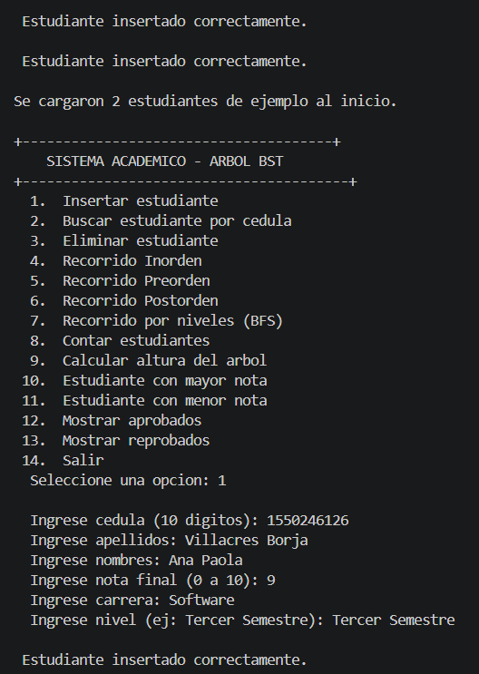

# Prueba Práctica - Árbol Binario de Búsqueda en C++

**Estudiante:** Shirley Amaguaña
**Semestre:** Tercer Semestre  
**Universidad:** Universidad Técnica de Ambato (UTA)  
**Carrera:** Ingeniería de Software  
**Asignatura:** Estructura de Datos  

---

# Descripción del Proyecto

Este proyecto consiste en el desarrollo de un sistema académico utilizando un **Árbol Binario de Búsqueda (BST)** en C++.

El sistema permite registrar y gestionar estudiantes mediante su número de cédula, aplicando estructuras dinámicas, recursividad, punteros y recorridos de árboles binarios.

Cada estudiante contiene la siguiente información:

- Cédula
- Apellidos
- Nombres
- Nota final
- Carrera
- Nivel

La cédula funciona como clave principal para organizar automáticamente el árbol.

---

# Funcionalidades Implementadas

El sistema cumple con todas las funciones solicitadas en la práctica:

insertarEstudiante()

buscarEstudiante()

eliminarEstudiante()

recorridoInorden()

recorridoPreorden()

recorridoPostorden()

recorridoPorNiveles()

contarNodos()

calcularAltura()

buscarNotaMayor()

buscarNotaMenor()

mostrarAprobados()

mostrarReprobados()

---

# 🔍 Recorridos Implementados

## Preorden
```txt
Raíz → Izquierda → Derecha
```

---

## Inorden
```txt
Izquierda → Raíz → Derecha
```

Este recorrido muestra los estudiantes ordenados por cédula.

---

## Postorden
```txt
Izquierda → Derecha → Raíz
```

---

## BFS - Por niveles
Recorre el árbol nivel por nivel utilizando una cola FIFO.

```txt
Nivel 0 → Raíz
Nivel 1 → Hijos
Nivel 2 → Nietos
```

---

# Menú del Sistema

```txt
1. Insertar estudiante
2. Buscar estudiante por cédula
3. Eliminar estudiante
4. Recorrido Inorden
5. Recorrido Preorden
6. Recorrido Postorden
7. Recorrido por niveles BFS
8. Contar estudiantes
9. Calcular altura del árbol
10. Mostrar estudiante con mayor nota
11. Mostrar estudiante con menor nota
12. Mostrar estudiantes aprobados
13. Mostrar estudiantes reprobados
14. Salir
```

---

# Tecnologías Utilizadas

- Lenguaje: C++
- Compilador: g++
- GitHub para control de versiones

---

# Instrucciones de Compilación y Ejecución

## Compilar el programa

```bash
g++ main.cpp -o sistema
```

## Ejecutar el programa
```bash
.\sistema.exe
```
---

# Estructura del Proyecto

```txt
prueba-practica-arboles-cpp-java/
│
├── main.cpp
├── README.md
│
├── assets/
│   ├── menu.png
│   ├── recorridos.png
│   └── operaciones.png
│
└── .gitignore
```

---

# Evidencias de Ejecución

## 1. Menú principal del sistema

En esta captura se muestra el menú interactivo y la inserción de estudiantes.



---

## 2. Recorridos del árbol binario

Se muestran los recorridos:

- Inorden
- Preorden
- Postorden
- BFS


---

## 3. Operaciones del sistema

Ejemplo de:

- búsqueda
- eliminación
- aprobados y reprobados
- cálculo de altura
- conteo de nodos


---

# Conceptos Aplicados

Durante el desarrollo se aplicaron los siguientes temas vistos en clase:

- Árboles binarios de búsqueda
- Recursividad
- Punteros
- Estructuras dinámicas
- Colas FIFO
- Recorridos DFS y BFS
- Manejo modular del código

---

# Explicación Técnica

## Recursividad

La recursividad fue utilizada para:

- insertar nodos
- buscar estudiantes
- eliminar nodos
- recorrer el árbol
- calcular altura
- contar nodos

---

## BFS usando cola

Para el recorrido por niveles se utilizó:

```cpp
queue<Nodo*> cola;
```

La cola permite recorrer el árbol de izquierda a derecha y nivel por nivel.

---

# Uso de GitHub 

## GitHub

El proyecto fue subido y versionado mediante GitHub utilizando varios commits durante el desarrollo.

---

# Conclusiones

Esta práctica permitió comprender mejor:

- El funcionamiento de los árboles binarios de búsqueda
- La aplicación de recursividad
- El uso de punteros en C++
- Los recorridos DFS y BFS
- El manejo de estructuras dinámicas

Además, se logró aplicar estos conceptos a un caso académico real.

---
